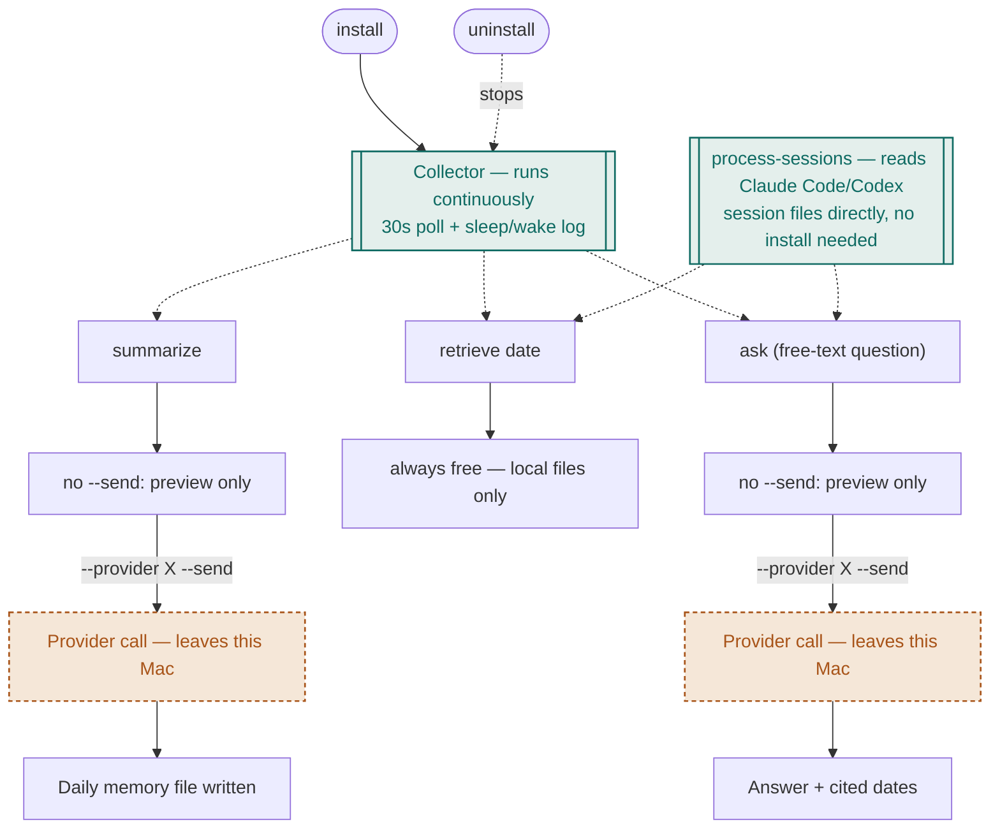
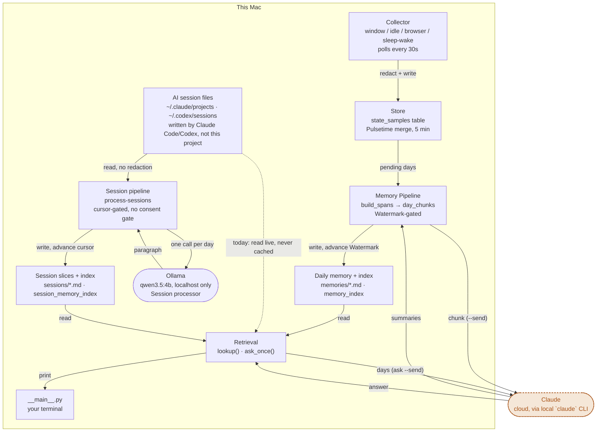
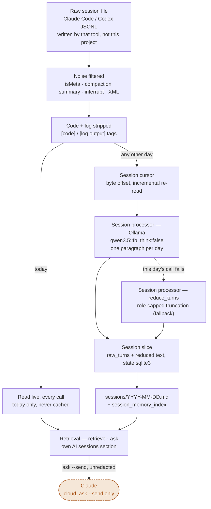

# Architecture

How `computer_history_local` works and what it collects — meant to be
readable on its own, without installing or running anything.

## How it works

Four views of the same system: what a person does at the terminal, which
modules that triggers, what happens to one piece of activity data from the
moment it's polled to the moment it's read back, and the same for one AI
session file.

Teal is the one color code that repeats across all four diagrams below —
**stays on this Mac**. Amber is the opposite — **leaves this Mac**, and only
ever happens where `--send` appears explicitly.

### User flow

One `install` starts the Collector running unattended. `process-sessions` is
the second, independent entry point — it needs no install and no Collector,
since it reads session files Claude Code and Codex already wrote themselves.
Everything else runs whenever you like. Both consent gates are the same
shape: no default provider, so `--send` without an explicit `--provider`
refuses outright rather than guessing. `uninstall` only ever touches the
LaunchAgent — captured data and generated memories are never deleted by it.

### Architecture

Two sources feed `Retrieval`, converging only there. `FakeProvider` and
`ClaudeCliProvider` sit behind one seam (`providers.provider_for`) — the
diagram's dashed amber edges are still the only two places a *network* call
can occur, and both only fire when `--send` is passed with an explicit
provider. `Ollama` looks similar in the diagram but isn't one of them: it's
`localhost`-only, never a real network hop, which is exactly why it's drawn
solid and un-amber like everything else on this Mac. It's the real
`Session processor` — one local call per day, summarizing that day's AI
session activity into a paragraph — and `process-sessions` refuses to run
at all if it isn't reachable, rather than quietly falling back to a
worse, character-truncated version of every day. The `AI session files`
source itself is different in kind from everything to its left: it isn't
captured by anything this project runs, carries no consent gate of its own,
and — unlike every other path into `Retrieval` — is never redacted before
it can reach `ask --send`.

### Data lifecycle

```mermaid
flowchart LR
    Raw["Raw signal<br/>app / window / URL, idle, pmset log"]
    Redacted["Redacted<br/>secret patterns + URL sanitize"]
    Sample["State sample<br/>Pulsetime-merged, stored indefinitely"]
    Batched["Batched + chunked<br/>one calendar day, ≤4,000 chars"]
    Provider["Provider call<br/>leaves this Mac"]:::transfer
    Entry["Timeline entry<br/>time range → summary → apps"]
    File["Daily memory file<br/>+ memory_index row"]
    Read["Read later — free<br/>retrieve · ask"]

    Raw --> Redacted --> Sample --> Batched --> Provider --> Entry --> File --> Read

    classDef transfer fill:#f5e7d8,stroke:#a85419,color:#a85419,stroke-width:1.5px,stroke-dasharray: 4 3;
```

One poll of the frontmost window, followed from raw signal to something you
can ask a question about. Redaction happens before the first write. A
`State sample` can then sit in local storage indefinitely — Capture has no
consent gate. The Provider call is the one stage that isn't local, and it's
the only stage gated by consent. The Watermark only advances once that
write has actually succeeded.

An AI session follows a shorter, different path: it's already text on disk,
written by Claude Code or Codex, not a raw signal this project polls — so
there's no redaction stage, and no consent gate before the Session cursor
can advance. It reaches `ask --send` exactly as it sits in the source file,
which is the one real asymmetry with the lifecycle above: worth knowing
before running `ask --send` over a day where you pasted a real credential
into a Claude Code or Codex session.

### AI session lifecycle

One session file, followed from raw JSONL to something `ask` can draw an
answer from. Noise filtering and code/log stripping happen before either
`Session processor` ever sees the text, whether or not an LLM is involved.
Today always takes the live branch — read fresh on every call, never
written anywhere; every other day goes through the Session cursor so a
resumed conversation only costs re-reading its new tail. `process-sessions`
refuses to run at all if Ollama isn't reachable (no silently-degraded
corpus), but a single day's call failing mid-run falls back to
`reduce_turns` for that one day only, flagged in the run's own output. The
dashed amber edge is the one place this content can leave the machine —
`ask --send`, and only that, unredacted.

## What this collects

Four channels, all written to one local `state.sqlite3`:

- **Frontmost app + window title** — polled every 30s via `osascript`. The
  window title needs Accessibility permission; without it, only the app
  name is captured. Passed through a redactor before it's ever written —
  API keys, bearer tokens, AWS access keys, and generic `key=value` secret
  assignments become `[REDACTED:...]` markers, since a terminal's window
  title is often its own command line.
- **Idle / away** — a boolean only, read from macOS's own idle timer:
  away past 3 minutes of no input, active otherwise. The precise idle
  duration itself is never stored, just whether the threshold was crossed.
- **Browser URL** — Chrome, Safari, Arc, and Brave only, the front tab of
  whichever is frontmost. Reduced to origin + path before it's ever
  written — no query string, fragment, or embedded credentials ever reach
  storage, since that's exactly where session tokens and search terms
  live. Passed through the same redactor as window titles.
- **Sleep / wake** — read back after the fact from `pmset -g log` (macOS's
  own system log, no new permission needed), checked every 10 minutes, so
  a gap in the other channels can be labeled "machine was asleep" rather
  than "person walked away" or "Collector died."

**Never captured by the Collector, at any point**: keystrokes, clicks, or
screen/screenshot content. The Collector records that something changed,
never what was typed or shown.

A fifth source works differently and sits outside the Collector entirely:

- **AI session history** — Claude Code's and Codex's own local session
  files (`~/.claude/projects/`, `~/.codex/sessions/`), read directly by
  `process-sessions`/`retrieve`/`ask`, never written by anything this
  project runs. This is deliberately the one place this project reads your
  own typed words back — mirroring OpenAI's Computer History is the whole
  point of this project, and that means reading an agent's own past
  sessions, not just app/window metadata. It has no consent gate and,
  unlike everything above, is **never redacted** before it can reach
  `ask --send` — worth reading twice before running `ask --send` over a
  day where you pasted a real credential into a session. The one session
  still open right now is always excluded, since it's already in the
  calling agent's own context. Unlike the four channels above, this one
  *does* persist more than its final output: `process-sessions` caches a
  reduced copy per day into `sessions/*.md`, but also keeps the underlying
  turns it was reduced from in this project's own `state.sqlite3`
  (`session_slices.raw_turns`), so a resumed conversation can be
  re-reduced correctly next run instead of needing a full re-read of the
  original file. That's a real, deliberate copy of your own AI
  conversation history sitting in local SQLite, not just a live
  pass-through — a design tradeoff, not an oversight.
  `process-sessions`'s day-level summaries are written by a local model
  (Ollama, `qwen3.5:4b`) rather than a plain truncation — still nothing
  leaving this Mac (Ollama's API is `localhost`-only), just a better
  reduction than character-capping could give.

Everything above stays on this Mac (Capture has no consent gate; AI session
reading has no consent gate either) until `summarize --send` or
`ask --send` sends it to a cloud model — the only two commands that ever
leave the machine, and both refuse to run without an explicit `--provider`.
