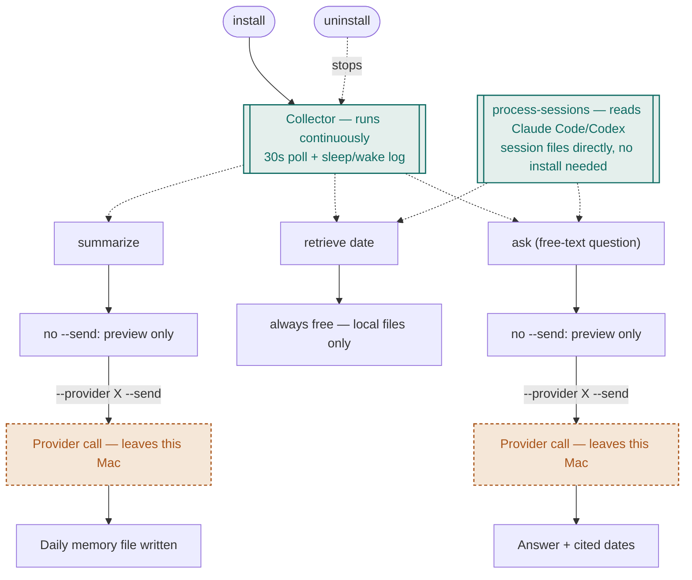
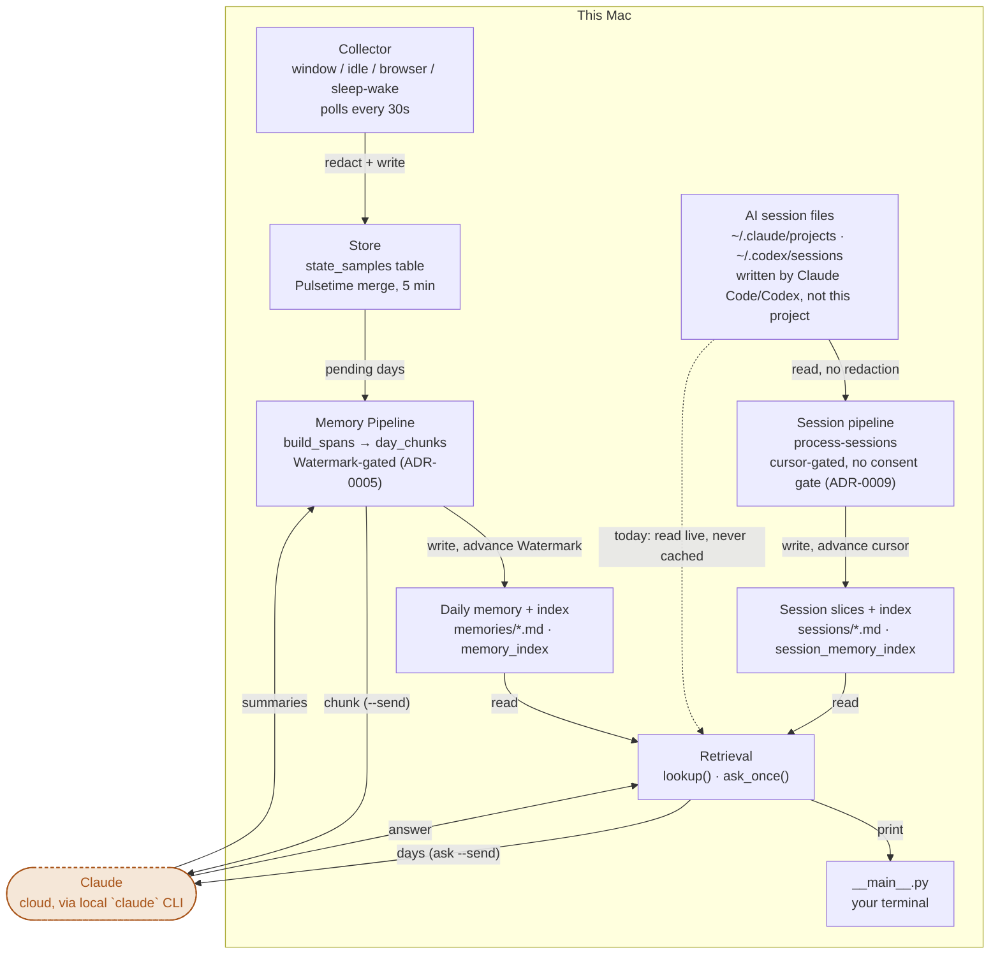

# computer_history_local

A local, OpenAI/ChatGPT-independent equivalent of ChatGPT's Computer History:
broad macOS activity capture, summarized into local memory, retrievable
later. Built for one person, this Mac, cloud APIs first and local models
last.

See [CONTEXT.md](CONTEXT.md) for the domain glossary and architecture,
[docs/adr/](docs/adr/) for why specific decisions were made, and
[docs/later.md](docs/later.md) for ideas considered and deferred.

## How it works

Three views of the same system, at three zoom levels: what a person does at
the terminal, which modules that triggers, and what happens to one piece of
activity data from the moment it's polled to the moment it's read back.

Teal is the one color code that repeats across all three diagrams below —
**stays on this Mac**. Amber is the opposite — **leaves this Mac**, and only
ever happens where `--send` appears explicitly.

### User flow



One `install` starts the Collector running unattended. `process-sessions` is
the second, independent entry point — it needs no install and no Collector,
since it reads session files Claude Code and Codex already wrote themselves
(`ADR-0009`). Everything else runs whenever you like. Both consent gates are
the same shape: no default provider, so `--send` without an explicit
`--provider` refuses outright rather than guessing (`ADR-0008`). `uninstall`
only ever touches the LaunchAgent — captured data and generated memories are
never deleted by it.

### Architecture



Two sources feed `Retrieval`, converging only there. `FakeProvider` and
`ClaudeCliProvider` sit behind one seam (`providers.provider_for`) — the
diagram's dashed amber edges are still the only two places a network call
can occur, and both only fire when `--send` is passed with an explicit
provider. The `AI session files` source is different in kind from
everything to its left: it isn't captured by anything this project runs,
carries no consent gate of its own (`ADR-0009`), and — unlike every other
path into `Retrieval` — is never redacted before it can reach `ask --send`
(`ADR-0010`).

### Data lifecycle

```mermaid
flowchart LR
    Raw["Raw signal<br/>app / window / URL, idle, pmset log"]
    Redacted["Redacted<br/>secret patterns + URL sanitize"]
    Sample["State sample<br/>Pulsetime-merged, stored indefinitely"]
    Batched["Batched + chunked<br/>one calendar day, ≤4,000 chars"]
    Provider["Provider call<br/>leaves this Mac"]:::transfer
    Entry["Timeline entry<br/>time range → summary → apps"]
    File["Daily memory file<br/>+ memory_index row"]
    Read["Read later — free<br/>retrieve · ask"]

    Raw --> Redacted --> Sample --> Batched --> Provider --> Entry --> File --> Read

    classDef transfer fill:#f5e7d8,stroke:#a85419,color:#a85419,stroke-width:1.5px,stroke-dasharray: 4 3;
```



One poll of the frontmost window, followed from raw signal to something you
can ask a question about. Redaction happens before the first write
(`ADR-0006`). A `State sample` can then sit in local storage indefinitely —
Capture has no consent gate (`ADR-0004`). The Provider call is the one stage
that isn't local, and it's the only stage gated by consent. The `Watermark`
only advances once that write has actually succeeded (`ADR-0005`).

An `AI session` follows a shorter, different path: it's already text on
disk, written by Claude Code or Codex, not a raw signal this project polls
— so there's no redaction stage, and no consent gate before the `Session
cursor` can advance (`ADR-0009`). It reaches `ask --send` exactly as it sits
in the source file (`ADR-0010`), which is the one real asymmetry with the
lifecycle above: read `ADR-0010` before running `ask --send` over a day
where you pasted a real credential into a Claude Code or Codex session.

## What this collects

Four channels, all written to one local `state.sqlite3`, nothing else:

- **Frontmost app + window title** — polled every 30s via `osascript`. The
  window title needs Accessibility permission; without it, only the app
  name is captured. Passed through a redactor before it's ever written —
  API keys, bearer tokens, AWS access keys, and generic `key=value` secret
  assignments become `[REDACTED:...]` markers, since a terminal's window
  title is often its own command line.
- **Idle / away** — a boolean only, read from macOS's own idle timer:
  away past 3 minutes of no input, active otherwise. The precise idle
  duration itself is never stored, just whether the threshold was crossed.
- **Browser URL** — Chrome, Safari, Arc, and Brave only, the front tab of
  whichever is frontmost. Reduced to origin + path before it's ever
  written — no query string, fragment, or embedded credentials ever reach
  storage, since that's exactly where session tokens and search terms
  live. Passed through the same redactor as window titles.
- **Sleep / wake** — read back after the fact from `pmset -g log` (macOS's
  own system log, no new permission needed), checked every 10 minutes, so
  a gap in the other channels can be labeled "machine was asleep" rather
  than "person walked away" or "Collector died."

**Never captured by the Collector, at any point**: keystrokes, clicks, or
screen/screenshot content. The Collector records that something changed,
never what was typed or shown — see `ADR-0001` for why capture stops at
that line.

A fifth source works differently and sits outside the Collector entirely:

- **AI session history** — Claude Code's and Codex's own local session
  files (`~/.claude/projects/`, `~/.codex/sessions/`), read directly by
  `process-sessions`/`retrieve`/`ask`, never written by anything this
  project runs. This is deliberately the one place this project reads your
  own typed words back — mirroring OpenAI's Computer History is the whole
  point of this project (`CONTEXT.md`'s `AI session` entry), and that
  means reading an agent's own past sessions, not just app/window
  metadata. It has no consent gate (`ADR-0009`) and, unlike everything
  above, is **never redacted** before it can reach `ask --send`
  (`ADR-0010`) — read that ADR before running `ask --send` over a day
  where you pasted a real credential into a session. The one session still
  open right now is always excluded, since it's already in the calling
  agent's own context (`CONTEXT.md`'s `Live session` entry).

Everything above stays on this Mac (`Capture` has no consent gate,
`ADR-0004`; AI session reading has no consent gate either, `ADR-0009`)
until `summarize --send` or `ask --send` sends it to a cloud model — the
only two commands that ever leave the machine, and both refuse to run
without an explicit `--provider` (`ADR-0008`).

## Requirements

- macOS
- Python 3.11+
- [Claude Code](https://claude.com/claude-code)'s `claude` CLI, installed
  and logged into a Claude subscription — `summarize --send` and `ask
  --send` shell out to it (`claude -p`) rather than a metered API key, the
  same reasoning `adhd_lifelog` uses. Nothing else needs a network call or
  a new permission: `pmset` (sleep/wake) and window/idle capture are both
  built into macOS.

## Install

```bash
git clone <this repo>
cd computer_history_local
pip install -e .
python -m computer_history_local install   # writes + loads a LaunchAgent
```

`install` starts the Collector running unattended in the background
(window, idle, browser, and sleep/wake — see `CONTEXT.md`'s `State
sample`/`System event` entries), and keeps it running across reboots.
Check it's actually capturing:

```bash
python -m computer_history_local status
```

## Usage

Everything below is `python -m computer_history_local <command>`. Data
lives under `~/.local/share/computer-history-local/` — `state.sqlite3`
(captured activity, the `Memory Pipeline`'s own index/watermark, and the
`Session pipeline`'s cursor/index), `memories/*.md` (one file per day, once
summarized), and `sessions/*.md` (one file per day with AI session content,
once `process-sessions` has covered it).

**Turn captured activity into a daily summary** (the `Memory Pipeline`,
manually triggered — nothing does this automatically yet):

```bash
python -m computer_history_local summarize                                   # free preview, no network call
python -m computer_history_local summarize --provider claude-cli --send      # spends real Claude usage, writes files
```

`--provider` has no default (`ADR-0008`) — it's required with `--send`, but
never read on a plain preview run above. `fake` is a network-free stand-in
provider for testing the wiring, not something you want against real data.

**Fold Claude Code/Codex session history into local `sessions/*.md` files**
(the `Session pipeline`, manually triggered, same as `summarize` — nothing
does this automatically yet either):

```bash
python -m computer_history_local process-sessions
```

Free and local, always — there's no `--send` here at all, since reading
these files never leaves the machine either way (`ADR-0009`). Safe to run
repeatedly: only newly appended turns since the last run are re-read
(`Session cursor`), and the still-open session you're running this from is
always skipped (`Live session`).

**Look up a day, or a range, for free** (`Retrieval`'s deterministic half —
no network call, no cost). Automatically includes that day's AI session
content too, as its own labeled section, when there is any — today's is
read live even without ever running `process-sessions`:

```bash
python -m computer_history_local retrieve 2026-08-17
python -m computer_history_local retrieve 2026-08-15 2026-08-17
```

**Ask a free-text question across every day summarized so far**
(`Retrieval`'s paid half — reads every `Daily memory` file that exists, plus
every day with AI session content, cached or today's live read):

```bash
python -m computer_history_local ask "what was I doing last week"                                       # free preview: which days, how many chars
python -m computer_history_local ask "what was I doing last week" --provider claude-cli --send            # spends real Claude usage, answers
```

`--send` is the only thing that ever sends anything off this Mac — every
command works, and nothing costs money or leaves the machine, without it.
The one exception to "nothing costs money without `--send`" being free of
consequence: once you do pass it, AI session content goes along unredacted
(`ADR-0010`) — see "What this collects" above before relying on this over a
day where you pasted a real credential into a Claude Code or Codex session.

## Uninstall

```bash
python -m computer_history_local uninstall
```

Stops and removes the Collector's LaunchAgent. Captured data and generated
memories under `~/.local/share/computer-history-local/` are left in place.

## Agent integration

`skills/computer-history/` teaches an agent how to answer "what was I doing
last week?" by calling this CLI, instead of guessing or fabricating an
answer. Two files, one per tool, since Claude Code and Codex load
instructions differently (Claude Code triggers a `SKILL.md` on demand;
Codex always loads `AGENTS.md` for the whole session):

**Claude Code** — install once so it's available in any project, not just
this one:

```bash
mkdir -p ~/.claude/skills/computer-history
cp skills/computer-history/SKILL.md ~/.claude/skills/computer-history/SKILL.md
```

**Codex** — append to the global instructions file (creates it if it
doesn't exist yet); check `~/.codex/AGENTS.md` first if you already have
one, so this doesn't get added twice:

```bash
mkdir -p ~/.codex
cat skills/computer-history/AGENTS.md >> ~/.codex/AGENTS.md
```

Either file only helps once there's something to read — the Collector
installed and running (see Install, above), or `process-sessions` run at
least once against existing Claude Code/Codex history.

## Development

```bash
pip install -e ".[dev]"
python -m pytest -q
```

Issues and design decisions are tracked as GitHub issues, including
Wayfinder maps (`wayfinder:map` label) for larger architecture questions —
see `docs/agents/issue-tracker.md`.
